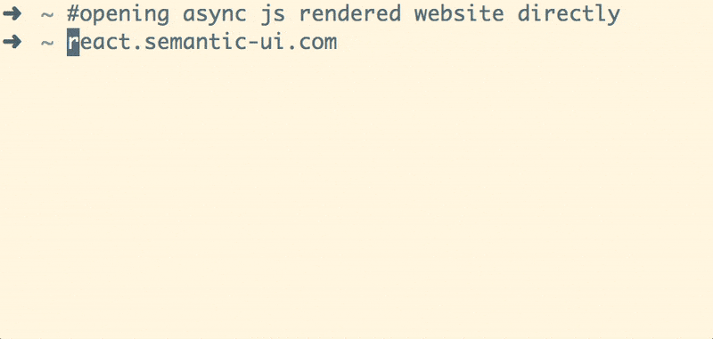

# SSR-Proxy — Server-Side Rendering Proxy

[](https://travis-ci.org/xiamx/ssr-proxy)

Prerender your single page app for better SEO and support on legacy browsers.

SSR-Proxy is a HTTP proxy which you can put in front of your existing Single Page App server to achieve server-side rendering. With SSR-Proxy, we take a different approach in Server-Side Rendering. Instead of rendering frontend components in Nodejs, we use an actual headless browser — PhantomJS to render SPA and proxy the rendered HTML to the client. 

## Demo

Directly accessing an async javascript rendered page vs. accessing an async javascript rendered page through SSR-Proxy

<p align="center">

</p>

## Get started

Install Node.js with version 6.4.0 and higher. Then follow the steps below.
```bash
npm install -g ssr-proxy
```

Then you can either invoke ssr-proxy using commandline params

```bash
ssr-proxy --upstream http://yoursinglepage.app.local
```

Or create and modify [config.json](config.json) with your desired configurations. The configuration parameters are explained in the section below.

```bash
ssr-proxy --config youconfig.json
```

Assuming you decide to keep the default proxy listening proxy port 5050, you can now access your ssr-proxy'ed SPA from [http://localhost:5050](http://localhost:5050).

If you need to use ssr-proxy as a library, it's possible to `npm install --save ssr-proxy` in your local project. ssr-proxy exposes a single default class named [`SSRProxy`](src/index.ts).

## Motivation

Quite a number of web apps built today are Single Page Apps (SPA.) [[1]] With React, Vuejs and other tools, building complex SPA is easier than ever before. One of the biggest challenge faced by SPAs is the diffculty in SEO (Search Engine Optimization.) When a webpage is asynchronously rendered via javascript (e.g. use ajax to fetch some documents and then display it inside a div), search engines cannot index them properly [[2], [4]].

Granted, most SPAs don't need to be indexed by search engines, But such demands have pushed the development of Universal Rendering, or Server-Side Rendering of frontend components. Universal Rendering does not come for free, developer now need to manage additional complexity of components lifecycles on both client-side and server-side. [[3], [5]]

With the approach offered by SSR-Proxy, we don't need code-level universal rendering. Hence, we can focus on developing a SPA that is designed to render in a browser, greatly reducing the complexity.

## Configuration

SSR-Proxy ships with a default configuration in `config.json` which should be usable in most scenarios. But you might need to modify it to get the desired behavoir.

- `upstream`: The root url of your single page app. SSR-Proxy will proxy all requests to this url.
- `idleMax`: SSR-Proxy consider a page rendered and send it back to the client if there are no network activity for more than `idleMax` milliseconds. A default value of `500` is set. If your SPA server is slower than that or your page renders with partial content, you may consider increasing this number. Decreasing this number shortens the page loading time, at the cost of possible missing content.
- `nodeHttpProxy`: A set of [options](https://github.com/nodejitsu/node-http-proxy#options) passed to when creating node-http-proxy server.
- `phantomjs.argv`: Commandline arguments when starting phantomjs.
- `port`: Port that this proxy server listens to.

## FAQ

### What is the performance overhead?

SSR-Proxy uses an adaptive timeout method to predict when a page is asynchronously loaded. That is -- when the requested page does not make network request for more than 500 ms (a configurable parameter named _idleMax_), ssr-proxy heuristically treats the page as being asynchronously rendered and send it to the client. So there is at least a minimal delay of _idleMax_ for each request. 

For this reason, it is best to use ssr-proxy behind nginx configured to send only requests from a particular user-agent (i.e. googlebot, ancient browsers)

### Does it cache rendered HTML?

No, it is best to use another proxy with sophisticated caching mechanism in front of SSR-Proxy, such as nginx or squid.

[1]: https://github.com/search?o=desc&q=require%28%27react-router%27%29&ref=searchresults&s=indexed&type=Code&utf8=%E2%9C%93

[2]: http://webcache.googleusercontent.com/search?q=cache:ypDo69X-oj0J:react.semantic-ui.com/&num=1&hl=en&gl=ca&strip=1&vwsrc=0

[3]: http://jamesknelson.com/universal-react-youre-doing-it-wrong/

[4]: https://engineering.pinterest.com/blog/demystifying-seo-experiments

[5]: http://cs.mcgill.ca/~mxia3/2016/12/03/The-cost-of-Universal-Rendering/

[prerender.io]: https://prerender.io/